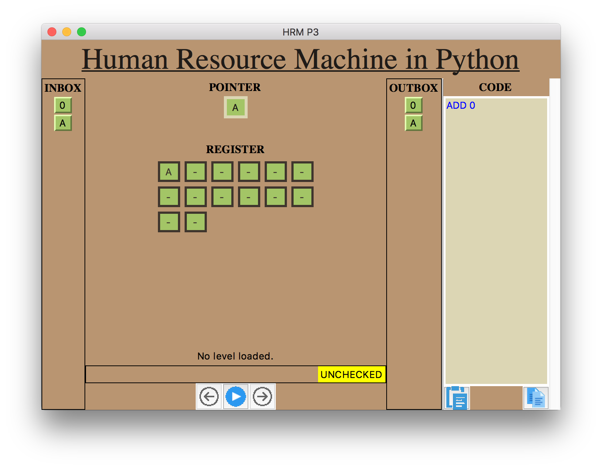

# Human Resource Machine Python Editor




## Introduction
This project started as an interpreter for the human resource machine format, but after some done stuff I started to create a gui and the target changed.

So the goal is now to create an editor/ ide for the human resource machine format. Supporting editing, executing and debugging the hrm-format.


## Available operators

Operator                | Effect
---                    |---
INBOX                  |Pop next value from INBOX to POINTER 
OUTBOX                 |Put value from POINTER to OUTBOX 
COPYFROM `<REF>`       |Copy value to POINTER        
COPYTO   `<REF>`       |Copy value to referenced register
ADD      `<REF>`       |Adds value from REF to POINTER
SUB      `<REF>`       |Subtracts value from REF to POINTER
BUMPUP   `<REF>`       |Increment value of REF and copy it into POINTER
BUMPDN   `<REF>`       |Decrement value of REF and copy it into POINTER
JUMP     `<LABEL>`     |Jump to LABEL
JUMPZ    `<LABEL>`     |Jump to LABEL if POINTER is zero
JUMPN    `<LABEL>`     |Jump to LABEL if POINTER is negative
COMMENT  0             |Will be ignored


## REF
REF declares which register to use for operator, there are two types available:
- Direct access: `1`
- Indirect access: `[1]`
-- Accesses the register, defined by the value of declared register 

Example:
```
INBOX //1
COPYTO 1
BUMPUP [1]
COPYFROM 1
OUTBOX //2
```

## JUMP/LABEL
With a JUMP operator the PC (program counter - defines which position in code should be interpreted)
will set to the given LABEL

Example:
```
INBOX //1
COPYTO 1
JUMP a
BUMPUP 1 //Skipped
a:
OUTBOX //1
```

## POINTER
The machine is able to keep one value on the "BUS" (keep it active).
This value is used in operations like outbox or inbox.

## Roadmap

### Backend
[x] Return new state from tick <br>
[x] Create level module holding state, messages and check 1-4<br>
[ ] Create level module holding state, messages and check 4-<br>
[ ] Support character as values <br>


### GUI
[x] Undo Button to go back to previos state <br>
[x] Reset button setup first state <br>
[x] En- and disable buttons <br>
[x] Editable code window <br>
[x] Highlight code and mark errors<br>
[x] Load menu for Level <br>
[x] Load code from file<br>
[x] Save code to file<br>
[x] Add scrollbar to code editor<br>
[x] Center window
[-] Show when program finishes <br>
[x] Show errors when they occur <br>
[ ] Hotkeys: Move Up
[ ] Hotkeys: Move Down
[ ] Hotkeys: Delete Line
[ ] Use pymitter events to communicate <br>
[ ] Add help for syntax in some way<br>
[ ] Automatic timer for tick (Slider 1s-5s) ("Play" and "Break" button)<br>
[ ] Use icons <br>
[ ] Show level check result <br>
[ ] Copy Solution to clipboard <br>
[ ] Add statistics about execution <br>
[ ] Editable inbox window <br>
[ ] Editable regs window <br>
